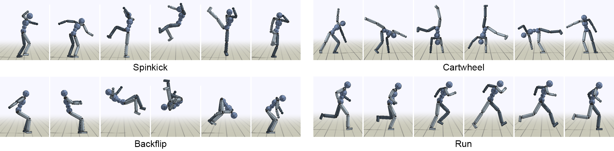
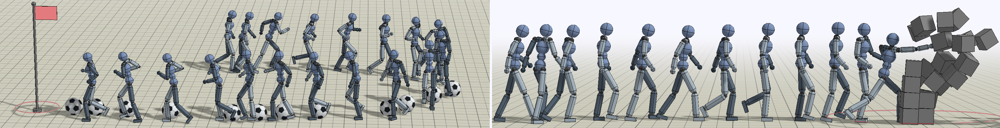

# COMP5214 Project: Deep Imitation Learning for Bipedal Robot Manipulation
Leslie Lee Chun Hei, Yueh Nicole Chee Lin

## Overall Idea

We would like to explore humanoid locomotion methods using deep imitation learning. With this goal, we tried to implement different DRL algos with GAIL. The framework we used is from Deep Mimic with AMP.

The contribution of our project includes:

1) Explore possiblility of implementing Deep Mimic AMP with deterministic and stochastic off-policy algorithms including TD3 and SAC. 
2) Explored the existing network settings with different parameters for achieving an optimal performance
3) Proposed an optimized PPO variant named Leaky Double Critic Proximal Policy Optimization (LDPPO) which can effectively reduce the number of parameters
needed given the same performances while ensuring exploration ability comparing. 
4) Generated a stable and human-like enough walking with the algorithms mentioned

## Results
As it requires a lot of time for training on our limited hardware, the training below is compared with trained agent achieving at most 550 test reward (~30M Parameters, 6000 iteration, where humanoid can walk for at least 2 steps). 
The result of default settings under this limitation is:


### Off-policy Algos: TD3 vs SAC vs PPO under Deep Mimic AMP framework


### Parameters Exploring: 10X Learning Rate


### Parameters Exploring: Change of Network Depth


Result of 256 x 256 x256:


### Parameters Exploring: Change of Network Width


Result of 512 x 512:


### LDPPO vs PPO-Clip
LDPPO has achieved the same or even better results than the others at ～9.5 parameters, 2300 iteration. The results at iteration 2300 is shown below:


### Below is the instruction foor installation of Deep Mimic
__________________________________________________________________________________________________


# Intro 

Code accompanying the following papers:

"DeepMimic: Example-Guided Deep Reinforcement Learning of Physics-Based Character Skills" \
(https://xbpeng.github.io/projects/DeepMimic/index.html) \


"AMP: Adversarial Motion Priors for Stylized Physics-Based Character Control" \
(https://xbpeng.github.io/projects/AMP/index.html) \


The framework uses reinforcement learning to train a simulated humanoid to imitate a variety
of motion skills from mocap data.


## Dependencies

``sudo apt install libgl1-mesa-dev libx11-dev libxrandr-dev libxi-dev``

``sudo apt install mesa-utils``

``sudo apt install clang``

``sudo apt install cmake``

C++:

- Bullet 2.88 (https://github.com/bulletphysics/bullet3/releases)

  Download Bullet 2.88 from the above link and install using the following commands.
  
	``./build_cmake_pybullet_double.sh``
	
	``cd build_cmake``
	
	``sudo make install``

- Eigen (http://www.eigen.tuxfamily.org/index.php?title=Main_Page) (Version : 3.3.7)

	``mkdir build && cd build``
	
	``cmake ..``
	
	``sudo make install``

- OpenGL >= 3.2
- freeglut (http://freeglut.sourceforge.net/) ( Version : 3.0.0 )

	``cmake .``
	
	``make``
	
	``sudo make install``
  
- glew (http://glew.sourceforge.net/) ( Version : 2.1.0 )

	``make``
	
	``sudo make install``
	
	``make clean``

Misc:

- SWIG (http://www.swig.org/) ( Version : 4.0.0 )

	``./configure --without-pcre``
	
	``make``
	
	``sudo make install``

- MPI 
	- Windows: https://docs.microsoft.com/en-us/message-passing-interface/microsoft-mpi
	- Linux: `sudo apt install libopenmpi-dev`


Python:

- Python 3
- PyOpenGL (http://pyopengl.sourceforge.net/) 

``pip install PyOpenGL PyOpenGL_accelerate``

- Tensorflow (https://www.tensorflow.org/) ( Vesrion : 1.13.1 )

``pip install tensorflow`` 
- MPI4Py (https://mpi4py.readthedocs.io/en/stable/install.html)

``pip install mpi4py``

## Build
The simulated environments are written in C++, and the python wrapper is built using SWIG.
Note that MPI must be installed before MPI4Py. When building Bullet, be sure to disable double precision with the build flag `USE_DOUBLE_PRECISION=OFF`.

### Windows
The wrapper is built using `DeepMimicCore.sln`.

1. Select the `x64` configuration from the configuration manager.

2. Under the project properties for `DeepMimicCore` modify `Additional Include Directories` to specify
	- Bullet source directory
	- Eigen include directory
	- python include directory

3. Modify `Additional Library Directories` to specify
	- Bullet lib directory
	- python lib directory

4. Build `DeepMimicCore` project with the `Release_Swig` configuration and this should
generate `DeepMimicCore.py` in `DeepMimicCore/`.


### Linux
1. Modify the `Makefile` in `DeepMimicCore/` by specifying the following,
	- `EIGEN_DIR`: Eigen include directory
	- `BULLET_INC_DIR`: Bullet source directory
	- `PYTHON_INC`: python include directory
	- `PYTHON_LIB`: python lib directory

2. Build wrapper,
	```
	make python
	```
This should generate `DeepMimicCore.py` in `DeepMimicCore/`


## How to Use
Once the python wrapper has been built, training is done entirely in python using Tensorflow.
`DeepMimic.py` runs the visualizer used to view the simulation. Training is done with `mpi_run.py`, 
which uses MPI to parallelize training across multiple processes.

`DeepMimic.py` is run by specifying an argument file that provides the configurations for a scene.
For example,
```
python DeepMimic.py --arg_file args/run_humanoid3d_spinkick_args.txt
```

will run a pre-trained policy for a spinkick. Similarly,
```
python DeepMimic.py --arg_file args/play_motion_humanoid3d_args.txt
```

will load and play a mocap clip. To run a pre-trained policy for a simulated dog, use this command
```
python DeepMimic.py --arg_file args/run_dog3d_pace_args.txt
```

To train a policy, use `mpi_run.py` by specifying an argument file and the number of worker processes.
For example,
```
python mpi_run.py --arg_file args/train_humanoid3d_spinkick_args.txt --num_workers 16
```

will train a policy to perform a spinkick using 16 workers. As training progresses, it will regularly
print out statistics and log them to `output/` along with a `.ckpt` of the latest policy.
It typically takes about 60 millions samples to train one policy, which can take a day
when training with 16 workers. 16 workers is likely the max number of workers that the
framework can support, and it can get overwhelmed if too many workers are used.

A number of argument files are already provided in `args/` for the different skills. 
`train_[something]_args.txt` files are setup for `mpi_run.py` to train a policy, and 
`run_[something]_args.txt` files are setup for `DeepMimic.py` to run one of the pretrained policies.
To run your own policies, take one of the `run_[something]_args.txt` files and specify
the policy you want to run with `--model_file`. Make sure that the reference motion `--motion_file`
corresponds to the motion that your policy was trained for, otherwise the policy will not run properly.

Similarly, to train a policy using amp, run with the corresponding argument files:
```
python mpi_run.py --arg_file args/train_amp_target_humanoid3d_locomotion_args.txt --num_workers 16
```

Pretrained AMP models can be evaluated using:
```
python DeepMimic.py --arg_file args/run_amp_target_humanoid3d_locomotion_args.txt
```

## Interface
- the plot on the top-right shows the predictions of the value function
- right click and drag will pan the camera
- left click and drag will apply a force on the character at a particular location
- scrollwheel will zoom in/out
- pressing 'r' will reset the episode
- pressing 'l' will reload the argument file and rebuild everything
- pressing 'x' will pelt the character with random boxes
- pressing space will pause/resume the simulation
- pressing '>' will step the simulation one step at a time


## Mocap Data
Mocap clips are located in `data/motions/`. To play a clip, first modify 
`args/play_motion_humanoid3d_args.txt` and specify the file to play with
`--motion_file`, then run
```
python DeepMimic.py --arg_file args/play_motion_humanoid3d_args.txt
```

The motion files follow the JSON format. The `"Loop"` field specifies whether or not the motion is cyclic.
`"wrap"` specifies a cyclic motion that will wrap back to the start at the end, while `"none"` specifies an
acyclic motion that will stop once it reaches the end of the motion. Each vector in the `"Frames"` list
specifies a keyframe in the motion. Each frame has the following format:
```
[
	duration of frame in seconds (1D),
	root position (3D),
	root rotation (4D),
	chest rotation (4D),
	neck rotation (4D),
	right hip rotation (4D),
	right knee rotation (1D),
	right ankle rotation (4D),
	right shoulder rotation (4D),
	right elbow rotation (1D),
	left hip rotation (4D),
	left knee rotation (1D),
	left ankle rotation (4D),
	left shoulder rotation (4D),
	left elbow rotation (1D)
]
```

Positions are specified in meters, 3D rotations for spherical joints are specified as quaternions `(w, x, y ,z)`,
and 1D rotations for revolute joints (e.g. knees and elbows) are represented with a scalar rotation in radians. The root
positions and rotations are in world coordinates, but all other joint rotations are in the joint's local coordinates.
To use your own motion clip, convert it to a similar style JSON file.

## Possible Issues and Solutions

ImportError: libGLEW.so.2.1: cannot open shared object file: No such file or directory
search for libGLEW.so.2.1 and use the following command accordingly
ln /path/to/libGLEW.so.2.1 /usr/lib/x86----/libGLEW.so.2.1
ln /path/to/libGLEW.so.2.1.0 /usr/lib/x86----/libGLEW.so.2.1.0

ImportError: libBulletDynamics.so.2.88: cannot open shared object file: No such file or directory
export LD_LIBRARY_PATH=/usr/local/lib/ ( can be temporary when run in terminal) 
(libBullet file are present in that path - gets installed in that path after the command sudo make install while installing Bullet)

## Misc.
- A ROS compatible URDF of the humanoid is available here: https://github.com/EricVoll/amp_motion_conversion

